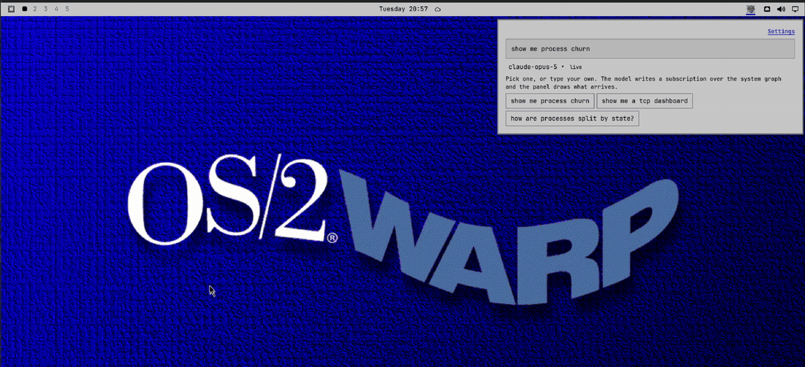
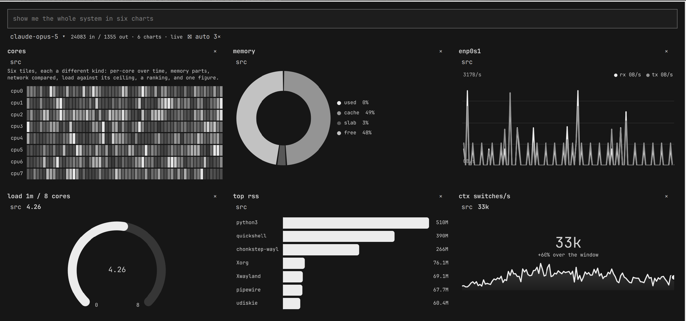
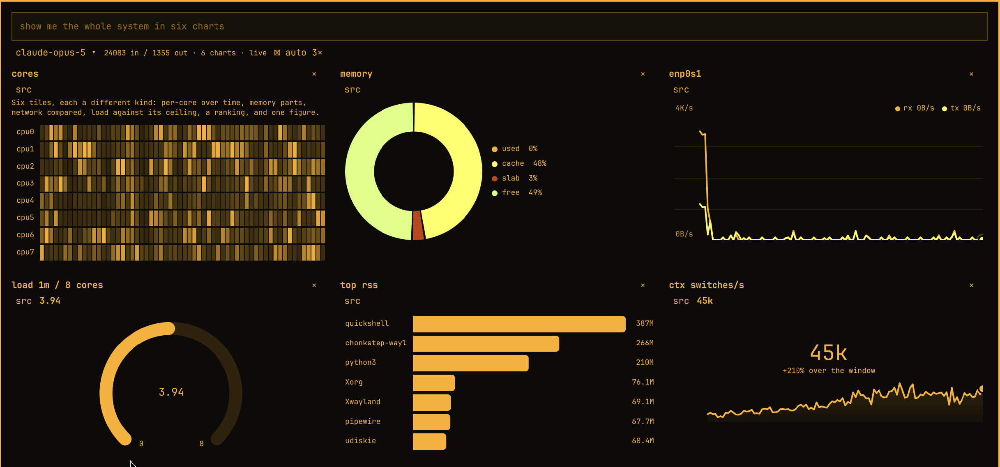
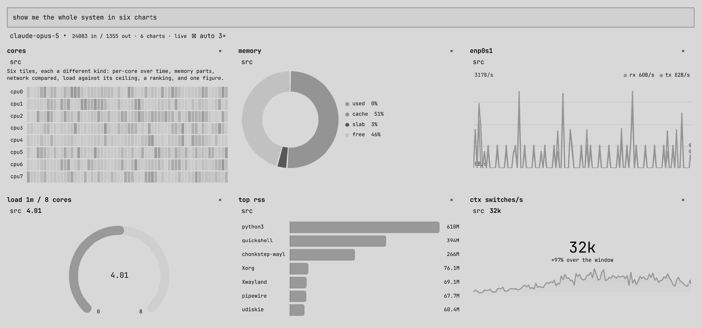
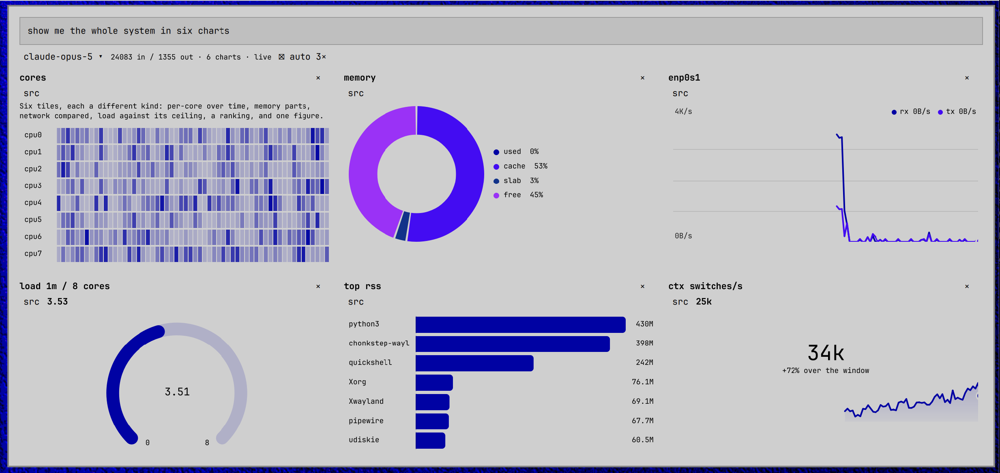

<!-- yeet:user-friendly-title: Ask AI for a live chart of your host -->
# yeet-ai

> **Ask for a chart of this host and get one, live, in the [Omarchy](https://omarchy.org) bar.** The model does not describe the reading; it writes the instrument that takes it, and the panel draws what arrives.

<p align="center">
  
  
  
  
  <a href="https://discord.gg/JxVseaAVAU"></a>
</p>

Click the yeet icon; a panel drops down with one input and three
suggestions. Ask — *show me the whole system in six charts*, *how busy
is each cpu core?*, *which processes use the most memory?* — and a
subscription over the system graph starts in a yeet isolate on the
machine, with a sentence on which chart was chosen and why. Twelve
kinds, from gauges and heat maps to rankings and scatters, in a grid
that grows with every question.



Every colour is the theme's. Series take the accent and hues turned
from it — greys on a monochrome theme — so the same dashboard belongs to
whatever is running, and follows a theme change on the spot:

<p align="center">
  
  
  
  
</p>

## Requirements

- [yeet](https://yeet.cx) — `yeet` on `PATH` with `yeetd` running, and
  `yeet login` completed. Charts need the daemon; asking needs the login,
  since the model is reached through the platform's `yeet:ai`.
- `script` from util-linux, which every Arch install has

The plugin runs one isolate — `yeet run app.js` under `script`, so it has a
terminal — and talks to it over that process's stdin and stdout. No port is
opened. Charts live in that isolate, which stops a few seconds after the
last bar widget goes away, so a shell restart clears the panel.

## Install

Add the plugin first. Until yeet is installed and its daemon running, the
bar item shows what is missing and how to fix it:

```sh
omarchy plugin add https://github.com/yeet-src/omarchy-yeet-ai --enable
```

Then run the pinned installer from the plugin checkout and log in. The
installer fetches a fixed yeet release for your architecture, checks the
package's sha256 and signature against values written in the script,
installs it and starts the daemon:

```sh
sh ~/.config/omarchy/plugins/cx.yeet.yeet-ai/install-yeet.sh
yeet login
```

To track new yeet releases along with the rest of the system, use the AUR
package [`yeet-bin`](https://aur.archlinux.org/packages/yeet-bin) instead:

```sh
yay -S yeet-bin
sudo systemctl enable --now yeetd
yeet login
```

Other package managers are covered in the
[manual installation guide](https://yeet.cx/docs/install/manual-installation).

The model is chosen from a pull-down in the panel — `claude-opus-5` by
default — from the list in `MODELS` at the top of `app/page.jsx`. The
choice lives as long as the isolate does.

## Remove

```sh
omarchy plugin remove cx.yeet.yeet-ai
```

## How a question becomes a chart

Twelve kinds: `area`, `line`, `overlay`, `stacked`, `split`, `heat`
and `sparks` over readings in time; `gauge`, `stat` and `meters` for
readings against a scale; `bars` and `pie` for a ranking or the parts
of a whole; `scatter` for two properties of many things. A new sample
slides in from the right, a changed bar or sector eases to its new
size, and the head of a live line pulses. Hover anything for its value.
This began as a fork of [proctop](https://github.com/yeet-src/omarchy-proctop)
with the fixed charts taken out and the model put in.


The model answers in markdown, and the part of the answer that is an
instrument rather than a sentence travels as a container directive —
the shape the yeet notebook's `:::ui` block has:

````markdown
CPU as a share of every core, one sample a second.

:::chart[cpu]{min=0 max=100 unit=%}
```js
let last = null;
subscribe(`subscription { kernel_stats(interval_ms: 1000) { total {
  user_ms nice_ms system_ms idle_ms iowait_ms irq_ms softirq_ms steal_ms } } }`, (d) => {
  const t = d.kernel_stats.total;
  const busy = t.user_ms + t.nice_ms + t.system_ms + t.irq_ms + t.softirq_ms + t.steal_ms;
  const all = busy + t.idle_ms + t.iowait_ms;
  if (last) plot(100 * (busy - last.busy) / (all - last.all));
  last = { busy, all };
});
```
::
````

The reply streams into the panel as it is written. The moment a block's
closing `::` lands, its body is compiled and run in the isolate — while
the model may still be writing the next one — with a small scope:

- `subscribe(gql, cb)` — `yeet.graph.subscribe`, torn down with the chart.
  Every field of the system graph has a subscription form, and
  `interval_ms` sets the rate, so nothing here polls.
- `plot(value)` — a number is a time series; an object of numbers is
  several series stacked on one axis; an array of `{ label, value }` is a
  ranking drawn as horizontal bars, replaced on every call.
- `rate(key, counter)` — per-second change of a cumulative counter such as
  `recv_bytes`, which is how throughput is drawn.
- `graph(gql)` — a one-shot query, for finding a pid or a name first.
- `state`, `onCleanup(fn)`, `log(...)`.

Attributes on the block set the axis (`min= max=`), the unit (`%`, `B`,
`B/s`, or any suffix), the braille rows per graph (`rows=`), and an
`id=` that keeps a chart's history across a rewrite. A body that
returns a value instead of subscribing is polled on `live=` ms.

`kind=` says how the data is drawn, and the prompt walks the model
through choosing it before it writes: a reading with a ceiling is a
`gauge`, parts of a whole a `pie` now or `stacked` over time, a ranking
`bars`, one reading per thing over time a `heat` map, a comparison an
`overlay`, readings of different magnitudes a `split`, two properties
of many things a `scatter`, and one reading over time an `area` or
`line`. The drawing is the framework's `<chart>` node, a Canvas that
takes the data as JSON and paints it in the theme's colours.

Charts tile a single grid: one column, then two from the second chart,
three from the fifth and four from the tenth, or pinned with the `⊞`
button, and never more than the screen has room for. The panel widens
to hold them and scrolls within what the screen leaves. Under each
chart sits the model's sentence; `×` on a heading removes its question.

The model does not guess field names. At start the isolate introspects
the system graph and renders it as compact SDL — types, arguments,
descriptions clipped to a line, and the `!` marks that say which fields
can be null — and that schema rides in every prompt, with the rule that
a nullable step is guarded. `graph_schema` and `graph_query` are its
two tools for looking closer, the same pair the yeet `graph-chat`
example uses. When a block still fails (a bad selection, a field that is
null only sometimes), the error goes back to the model and the
rewritten block is substituted in place, bounded at two repairs per
question. `src` on any chart shows the code that is running, because
the code was written by a model and is running on your host.

The bar item shows the newest chart's last eight samples and its latest
value, so a chart keeps reporting after the panel is shut.

## Building from source

The installable plugin is committed at the repository root — `manifest.json`,
`BarWidget.qml`, `Panel.qml`, `app.js` and the vendored `yeetkit/` runtime — so
a clone is ready to load with no build step. The source of that output is
under `app/`:

```
app/page.jsx       the panel, the bar item, and the wiring between them
app/directive.js   the :::chart parser — a streaming reply leaves the last block open
app/cells.js       a running block: compile, scope, plot, teardown
app/draw.js        the bar item's braille sparkline, axes and number formatting
app/agent.js       the turn loop over yeet:ai, tools and repairs included
app/tools.js       graph_schema and graph_query
app/prompt.js      what the model is told
app/schema.js      the system graph introspected into the SDL the prompt carries
```

Rebuilding needs nothing outside this repository. The framework it is built
with, [yeetkit-omarchy](https://github.com/yeet-src/yeetkit-omarchy), is
committed as a packed tarball under `vendor/`, and `package.json` depends on
that file:

```sh
npm install
npm test         # the parser, the drawing, the cell runtime and the agent loop, under Node
npm run dist     # build into plugin/, then sync it to the root
npm run check    # drive the built plugin over a real portal
```

`scripts/ask.js` asks one question from a terminal with no shell in the
loop — the same agent, prompt, tools and chart runtime the panel uses —
then runs every block the reply carries for a few seconds and prints
what it plotted, or the error the panel would have sent back for repair:

```sh
yeet run scripts/ask.js "network throughput"
```

`npm test` covers everything that does not need a host: the directive
parser against streamed and closed replies, the braille and bar drawing,
a cell fed by a scripted graph (plots, rates, failures, timeouts,
teardown) and the agent loop against a scripted stream. `npm run check`
needs `yeet` and its daemon.

The three example bubbles are drawn from a bank of thirty-two
questions spanning every kind, verified to come back as a chart that
draws; they move on every ten seconds and on each opening of the panel,
and Enter on the empty input asks the one in the placeholder.

Logged out, the panel says so and shows the login itself: the shell
runs `yeet login`, and the one-time URL it prints appears with a copy
button and one that opens it in the browser. When the login completes
the input comes back. Charts already drawn keep running throughout,
since the graph needs no login.

A chart that fails says so under its header in the panel, in the theme's
urgent colour. The isolate runs under `script`, which folds its stderr
into the wire, so its console output never reaches the shell log; to
see a failure in a terminal, ask the same question through
`scripts/ask.js`.

`npm run dev` builds straight into `~/.config/omarchy/plugins/cx.yeet.yeet-ai`
and rebuilds on change. The shell reloads `app.js` on its own, but
picking up a change to the QML entry files needs `omarchy restart shell`.

## Licence

Apache-2.0. See [LICENSE](LICENSE).
